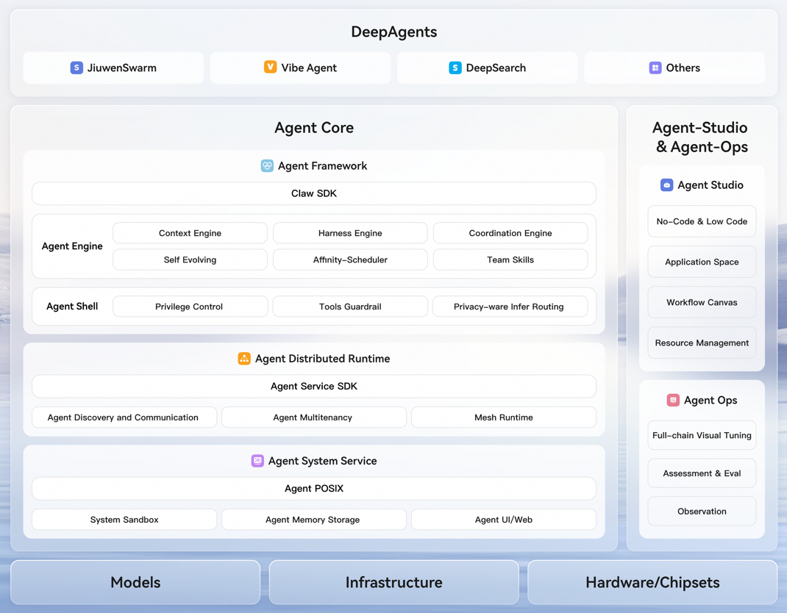
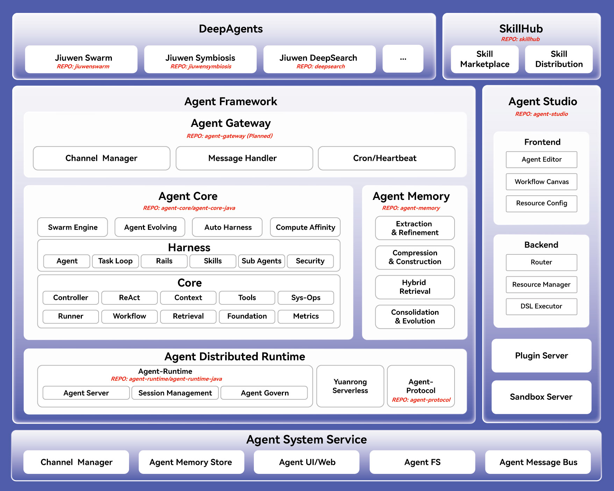
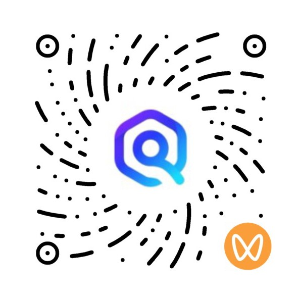

# openJiuwen Contribution Guide

Welcome to the openJiuwen community! As an open-source Agent platform, openJiuwen is dedicated to providing flexible, powerful, and easy-to-use AI Agent development and runtime capabilities. We encourage developers to participate in the community in a variety of ways, including but not limited to code contributions, documentation improvements, issue reports, and feature suggestions.

## Table of Contents

- [Before You Start](#before-you-start)
- [Types of Contributions](#types-of-contributions)
- [Code Contribution Workflow](#code-contribution-workflow)
- [Development Guidelines](#development-guidelines)
- [Submission Workflow](#submission-workflow)
- [Code Review](#code-review)
- [Community Communication](#community-communication)

---

# System Architecture

openJiuwen adopts a layered architecture that covers the full lifecycle of an AI Agent—from development and runtime to deployment and operations. It consists of **DeepAgents**, **Agent Studio**, **Agent Framework**, **Agent Distributed Runtime**, and **Agent System Service**.
- **DeepAgents**: Provides complex agents for different scenarios, such as JiuwenSwarm, JiuwenSymbiosis, and DeepSearch, ready to use out of the box.
- **Agent Studio**: A one-stop AI Agent development platform offering low-code / no-code visual development. It supports Agent development, workflow orchestration, prompt tuning, online debugging, and resource management, helping developers quickly build and debug agents and workflows.
- **Agent Framework**: The core framework and execution engine of openJiuwen, providing developers with easy-to-use, multi-scenario interfaces for Agent development, orchestration, and invocation. It covers key capabilities such as complex task planning, loop execution, tool and skill invocation, context management, the memory subsystem, multi-agent collaboration, Agent self-evolution, and compute-affinity scheduling—comprehensively supporting the engineering implementation of everything from a single Agent to multi-Agent collaboration.
- **Agent Distributed Runtime**: Provides a distributed Agent runtime foundation that supports both low-code and high-code agent deployment modes, enabling one-click Agent publishing/deployment and unified full-lifecycle management. It natively includes core capabilities such as multi-tenant resource isolation, elastic service scaling, unified registration and discovery, and high-speed cross-cluster interconnection—comprehensively supporting the stable operation of large-scale multi-Agent clusters and business scale-out.
- **Agent System Service**: The underlying system service of AgentOS. It has built-in system-level security isolation sandboxes, globally unified persistent memory storage, native CLI system tools, a standardized Agent file system, a cross-Agent communication bus, and other low-level core capabilities—supporting secure operation of agents across the platform, unified resource scheduling, and efficient multi-Agent collaboration.



## Implementation Overview

openJiuwen adopts a modular repository design, building the AI Agent development ecosystem layer by layer. Each repository can evolve independently or be combined with others, covering the full chain from agent applications, skill distribution, and visual orchestration to framework development and service-based runtime.



### Repository Overview

<div style="overflow-x: auto;">
<table style="width: 100%; border-collapse: collapse; table-layout: fixed;">
  <colgroup>
    <col style="width: 18%;" />
    <col style="width: 26%;" />
    <col style="width: 56%;" />
  </colgroup>
  <thead>
    <tr>
      <th style="border: 1px solid; padding: 10px 12px; text-align: left; font-weight: 700;">Module</th>
      <th style="border: 1px solid; padding: 10px 12px; text-align: left; font-weight: 700;">Repository</th>
      <th style="border: 1px solid; padding: 10px 12px; text-align: left; font-weight: 700;">Description</th>
    </tr>
  </thead>
  <tbody>
    <tr>
      <td rowspan="3" style="border: 1px solid; padding: 10px 12px; font-weight: 700; vertical-align: middle;">Deep Agents</td>
      <td style="border: 1px solid; padding: 10px 12px; vertical-align: top;"><a href="https://github.com/openJiuwen-ai/jiuwenswarm">jiuwenswarm</a></td>
      <td style="border: 1px solid; padding: 10px 12px; vertical-align: top;">A multi-agent collaboration framework and official flagship application, supporting complex task collaboration and Skill self-evolution.</td>
    </tr>
    <tr>
      <td style="border: 1px solid; padding: 10px 12px; vertical-align: top;"><a href="https://github.com/openJiuwen-ai/jiuwensymbiosis">jiuwensymbiosis</a></td>
      <td style="border: 1px solid; padding: 10px 12px; vertical-align: top;">An Agent framework for embodied intelligence, supporting configuration-agnostic capability reuse and safety control.</td>
    </tr>
    <tr>
      <td style="border: 1px solid; padding: 10px 12px; vertical-align: top;"><a href="https://github.com/openJiuwen-ai/deepsearch">deepsearch</a></td>
      <td style="border: 1px solid; padding: 10px 12px; vertical-align: top;">A knowledge-augmented deep retrieval and research Agent for search, reasoning, and report-generation scenarios.</td>
    </tr>
    <tr>
      <td style="border: 1px solid; padding: 10px 12px; font-weight: 700; vertical-align: middle;">SkillHub</td>
      <td style="border: 1px solid; padding: 10px 12px; vertical-align: top;"><a href="https://github.com/openJiuwen-ai/skillhub">skillhub</a></td>
      <td style="border: 1px solid; padding: 10px 12px; vertical-align: top;">A Skill hosting and distribution platform, supporting Skill publishing, version management, search and download, shared reuse, and private deployment.</td>
    </tr>
    <tr>
      <td style="border: 1px solid; padding: 10px 12px; font-weight: 700; vertical-align: middle;">Agent Studio</td>
      <td style="border: 1px solid; padding: 10px 12px; vertical-align: top;"><a href="https://github.com/openJiuwen-ai/agent-studio">agent-studio</a></td>
      <td style="border: 1px solid; padding: 10px 12px; vertical-align: top;">A one-stop visual Agent development platform, supporting Agent editing, workflow orchestration, resource configuration, prompt tuning, and online debugging.</td>
    </tr>
    <tr>
      <td rowspan="4" style="border: 1px solid; padding: 10px 12px; font-weight: 700; vertical-align: middle;">Agent Framework</td>
      <td style="border: 1px solid; padding: 10px 12px; vertical-align: top;">agent-gateway</td>
      <td style="border: 1px solid; padding: 10px 12px; vertical-align: top;">A unified access gateway providing channel management, message processing, scheduled tasks, heartbeat, and more. Currently Opening Soon.</td>
    </tr>
    <tr>
      <td style="border: 1px solid; padding: 10px 12px; vertical-align: top;"><a href="https://github.com/openJiuwen-ai/agent-core">agent-core</a></td>
      <td style="border: 1px solid; padding: 10px 12px; vertical-align: top;">The Python Agent SDK, providing core capabilities such as Agent orchestration, runtime, models, tools, retrieval, and evaluation.</td>
    </tr>
    <tr>
      <td style="border: 1px solid; padding: 10px 12px; vertical-align: top;"><a href="https://github.com/openJiuwen-ai/agent-core-java">agent-core-java</a></td>
      <td style="border: 1px solid; padding: 10px 12px; vertical-align: top;">The Java Agent SDK, providing the Java ecosystem with Agent development capabilities consistent with the Python SDK.</td>
    </tr>
    <tr>
      <td style="border: 1px solid; padding: 10px 12px; vertical-align: top;"><a href="https://github.com/openJiuwen-ai/agent-memory">agent-memory</a></td>
      <td style="border: 1px solid; padding: 10px 12px; vertical-align: top;">A long-term memory system for agents, supporting memory extraction, compression, hybrid retrieval, knowledge accumulation, and autonomous evolution.</td>
    </tr>
    <tr>
      <td rowspan="3" style="border: 1px solid; padding: 10px 12px; font-weight: 700; vertical-align: middle;">Agent Distributed Runtime</td>
      <td style="border: 1px solid; padding: 10px 12px; vertical-align: top;"><a href="https://github.com/openJiuwen-ai/agent-runtime">agent-runtime</a></td>
      <td style="border: 1px solid; padding: 10px 12px; vertical-align: top;">The Python Agent Runtime, responsible for service-based Agent operation, session management, and lifecycle management.</td>
    </tr>
    <tr>
      <td style="border: 1px solid; padding: 10px 12px; vertical-align: top;"><a href="https://github.com/openJiuwen-ai/agent-runtime-java">agent-runtime-java</a></td>
      <td style="border: 1px solid; padding: 10px 12px; vertical-align: top;">The Java Agent Runtime, providing service-based Agent operation and deployment capabilities based on Spring Boot.</td>
    </tr>
    <tr>
      <td style="border: 1px solid; padding: 10px 12px; vertical-align: top;"><a href="https://github.com/openJiuwen-ai/agent-protocol">agent-protocol</a></td>
      <td style="border: 1px solid; padding: 10px 12px; vertical-align: top;">An Agent interoperability protocol SDK, providing the MCP SDK, A2A SDK, and A2X Registry.</td>
    </tr>
  </tbody>
</table>
</div>

### Follow the Code of Conduct

openJiuwen is an open-source community that relies entirely on the community to provide a friendly development and collaboration environment. Before contributing, please read and follow the [openJiuwen Community Code of Conduct](./openJiuwen社区行为准则.md).

### Sign the Contributor License Agreement (CLA)

**Important:** You must first sign the openJiuwen community "Contributor License Agreement" (CLA) before you can contribute to the openJiuwen community.

### Find a SIG That Interests You

A SIG (Special Interest Group) is the technical organizational unit of the openJiuwen community. For how to participate in a SIG, refer to the [SIG Governance Charter](./coreteam/openJiuwen%E7%A4%BE%E5%8C%BA%E7%AB%A0%E7%A8%8B.md#sig).

---

## Types of Contributions

The openJiuwen community welcomes many forms of contributions:

### Code Contributions

You can review existing code, make changes, report issues, or contribute original code. We encourage developers to participate in code feedback and contributions in various ways.

### Non-Code Contributions

- **Documentation contributions**: To contribute documentation, refer to the [Documentation Contribution Guide](./CONTRIBUTING_zh.md)
- **Compliance issues**: If you find a compliance issue, refer to [Open Source Compliance Issue Management](./contribute/开源合规类问题管理.md)
- **Security issues**: If you find a security/vulnerability issue, refer to:
  - [Cybersecurity Incident Management Process](./contribute/网络安全事件管理.md)
  - [Community Vulnerability Governance & Disclosure](./contribute/社区安全漏洞治理及披露.md)

---

## Code Contribution Workflow

### Environment Setup

1. **Install Git**
   - For Git installation, environment configuration, and usage, refer to GitHub's [Git documentation](https://docs.github.com/en/get-started/getting-started-with-git)

2. **Configure Your SSH Public Key**
   - To register an SSH public key, refer to GitHub's guide on [adding a new SSH key to your account](https://docs.github.com/en/authentication/connecting-to-github-with-ssh/adding-a-new-ssh-key-to-your-github-account)

3. **Find a Repository That Interests You**
   - Find a repository you're interested in on the openJiuwen code hosting platform

### Fork the Repository

1. Open the home page of the corresponding repository
2. Click the **Fork** button in the upper-right corner and follow the instructions to create a **personal** cloud fork

### Clone Locally

1. **Create a local working directory**

   ```bash
   mkdir ${your_working_dir}
   cd ${your_working_dir}
   ```

2. **Clone the remote repository**

   - Copy the remote repository address (`$remote_link`) from the repository page
   - Run the clone command locally:

   ```bash
   git clone $remote_link
   ```

### Create a Development Branch

1. **Create a branch**

   Update your local branch:

   ```bash
   git remote add origin $remote_link
   git fetch origin
   git checkout main
   git pull --rebase
   ```

   Create a local development branch based on the remote main branch:

   ```bash
   git branch myfeature origin/main
   git checkout myfeature
   ```

   Then edit and modify code on the `myfeature` branch.

---

## Development Guidelines

### License

openJiuwen is licensed under the [Apache License 2.0 (Apache-2.0)](https://www.apache.org/licenses/LICENSE-2.0).

### Copyright Guidelines

**Important:** Code submitted by users must be original and must not infringe on the intellectual property rights of others.

- When contributing code, follow the [License and Copyright Guidelines](./contribute/许可证与版权规范.md)
- If newly contributed code involves the introduction of third-party open-source software or snippet references, strictly follow the requirements in the [License and Special License Review Guide](./contribute/许可证与特殊许可证评审指导.md)
- openJiuwen reserves the right to modify/delete content contributed by developers as needed until it complies with the corresponding guidelines

### Design Guidelines

- [openJiuwen Security Design Guide](./contribute/style-guide/openJiuwen-security-design-guide.md)

### Code Style

Please follow the openJiuwen coding standards during code development and review, and be sure to keep the code style consistent.

- **Python coding standard**: [PEP 8](https://pep8.org/)
- **JavaScript coding standard**: [openJiuwen JavaScript Coding Style Guide](./contribute/style-guide/openJiuwen-JavaScript-coding-style-guide.md)

### Commit Message Guidelines

Commit messages follow [Conventional Commits](https://www.conventionalcommits.org/en/v1.0.0/). Adopting this convention improves the readability of commit history and makes it easier for automated tools to generate changelogs.

**Format:**
```
<type>(<scope>): <subject>
```

Notes:

- Write commit messages in English.
- Use `git rebase` to consolidate multiple scattered commits into a single atomic commit, ensuring a clear and traceable main-branch history.

**Types:**
- `feat:` A new feature
- `fix:` A bug fix
- `docs:` Documentation-only changes
- `style:` Changes that do not affect the meaning of the code (whitespace, formatting, etc.)
- `refactor:` A code change that neither fixes a bug nor adds a feature
- `perf:` A code change that improves performance
- `test:` Adding missing tests or correcting existing tests
- `ci:` Changes to CI configuration files and scripts
- `chore:` Changes to the build process or auxiliary tools and libraries


**Scope:** Optional; indicates the affected area, such as `model`, `agent`, `workflow`, etc.


**Examples:**
```bash
feat(model): add user authentication module
fix(front): resolve button click event issue
docs(guide): update contribution guidelines
style(agent): adjust code formatting to match style guide
refactor(workflow): simplify component structure
perf(runtime): optimize runtime performance
test(endpoint): add unit tests for API endpoints
ci: configure GitHub CI pipeline
chore: update dependencies to latest versions
```

**Complex commit format:**
For commits that require detailed explanations, use the multi-line format:

```
feat(core): add configuration management feature

Add configuration management module to support dynamic settings loading.
This feature includes:

- Configuration file parser
- Environment variable support
- Settings validation logic

Refs: #12345
```

---

## Submission Workflow

### 1. Commit Changes in Your Local Working Directory

```bash
git add .
git commit -sm "feat: xxx"  # Include your signoff email in the commit message
```

You may continue editing, building, and testing on top of a previous commit. Use `commit --amend` to keep adding to a commit.

### 2. Push Changes to Your Remote Repository

When you're ready for review (or just want an off-site backup of your work), push your branch to your fork:

```bash
git push -f origin myfeature
```

### 3. Create a Pull Request

1. Visit your fork's repository page
2. Click the **Create Pull Request** button
3. Select your feature branch to generate the PR
4. For detailed steps, refer to GitHub's [Creating a pull request](https://docs.github.com/en/pull-requests/collaborating-with-pull-requests/proposing-changes-to-your-work-with-pull-requests/creating-a-pull-request) documentation

**A PR description should include:**

- The purpose and background of the change
- A detailed description of the change
- Testing status
- Related issue number (using the `#I12345` format)

### 4. Link Issues and CI Gate Builds

#### Create an Issue

1. Open the home page of the corresponding repository
2. Select the **Issues** tab in the upper-left corner
3. Click the **New Issue** button on the right
4. Follow the instructions to create a dedicated task, used to run the CI gate for the associated code (feature development / bug fix)

#### Link an Issue to a PR

When creating a PR or editing an existing PR, enter `#I` + the five-digit issue ID (for example, `#I12345`) in the description box to link the issue to the PR.

#### Trigger the Code Gate

Once the gate finishes running, it will automatically comment the gate results on all PRs associated with the issue.

---

## Code Review

### PR Review Requirements

- A minimum number of reviewers must be met
- All review issues must be resolved before merging
- **Merging your own Pull Request is prohibited**
- Before merging a PR, ensure the associated pipeline tasks have run successfully and passed all checks

### Continuous Integration (CI)

openJiuwen uses Continuous Integration (CI) to detect code issues in a timely manner, ensuring reliable code quality and stable functionality:

- **Code gate**: After a developer submits a code merge request to openJiuwen, a gate check is triggered—such as static checks, code compilation, and functional testing. Code can only be merged after passing the gate.
- **Daily builds**: openJiuwen's CI pipeline runs automatically every day to detect issues in static checks, compilation, functionality, and more ahead of time, so problems can be fixed promptly and code quality is ensured.

---

## Community Communication

### Mailing List

If you encounter problems while using openJiuwen, please join the mailing group to participate in discussions. This is the proper way to participate in openJiuwen community discussions—refer to [Subscribe to the Mailing List](./maillist_zh.md).

<!-- Side by side -->
<div style="display:flex; align-items: flex-start; gap: 50px;">
    <div style="text-align: center;">
        
        <p>openJiuwen Official Account</p>
    </div>
    <div style="text-align: center;">
        
        <p>openJiuwen Video Channel</p>
    </div>
</div>


### Get Help

- Read the docs: [openJiuwen Documentation Center](https://github.com/openJiuwen-ai/docs)
- Submit an issue: Create an issue on the Issues page of the corresponding repository
- Join the discussion: Communicate with community members through the mailing list

---
This product serves only as a workflow orchestration tool and does not include AI model capabilities. When connecting an AI model for a specific business scenario, users must independently bear the relevant compliance obligations, such as those under the EU AI Act.
## Summary

**Thank you for your interest in and contributions to the openJiuwen community! We look forward to your participation in advancing AI Agent technology together.** 🎉
