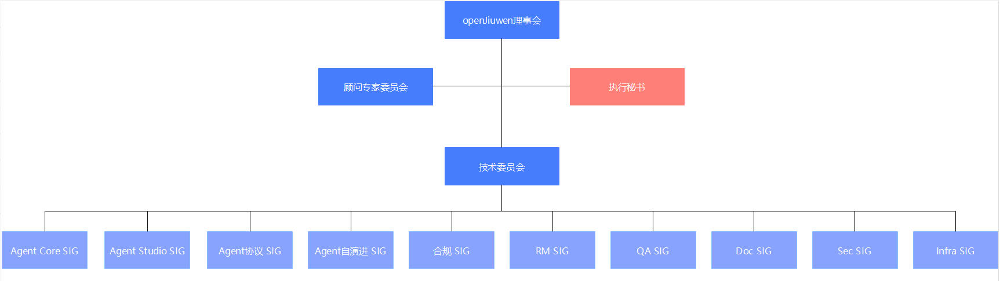

# openJiuwen社区章程

# 第一章 总则

## 第一条 愿景和使命

openJiuwen社区旨在构建一个开放、创新、协作的企业级大模型应用开发框架技术社区。通过社区成员的集体智慧与共同努力，打造世界领先的开发框架，降低大模型应用开发的技术门槛，推动AI技术在各个行业的广泛应用，构建一个繁荣、可持续的开发者生态。

## 第二条 项目群治理原则

本项目群以本项目群治理组织领导下的项目自治为原则，遵循开放透明、技术卓越、友好包容和协作共赢的前提下进行开放治理和运营。

## 第三条 社区行为准则

为建设开放友好的社区环境，本项目群贡献者和维护者承诺：不论年龄、体型、身体健全与否、民族、经验水平、受教育程度、社会地位、国籍、相貌、种族等，本项目群和社区的参与者皆免于任何骚扰。

**有助于创造积极社区环境的行为包括但不限于**：

* 措辞友好且包容；
* 尊重不同的观点和经验；
* 耐心接受有益批评；
* 关注对社区最有利的事情；
* 与社区其他成员友善相处。

**本项目群和社区的参与者不应采取的行为包括但不限于**：
* 发布与色情、暴力等有关的言论或图像；
* 捣乱/煽动/造谣行为、侮辱/贬损的评论、人身及政治攻击；
* 公开或私下骚扰本项目群和社区的其他参与者；
* 未经明确授权发布他人的个人信息等资料，如住址、电子邮箱等；
* 其他有理由认定为违反社区行为准则的不当行为。

社区项目维护者(Maintainer)有权利和义务诠释何谓“不当行为”，并妥善公正地纠正已发生的不当行为。社区项目维护者有权利和义务删除、编辑、拒绝违背本行为准则的评论（comments）、提交（commits）、代码、wiki 编辑、问题（issues）等任何贡献；社区项目维护者可暂时或永久地封禁任何其认为有威胁、冒犯、有害社区秩序的不当行为参与者。

本行为准则适用于本社区。当有人代表本社区时，本准则亦适用于此人所处的公共平台。代表本社区的情形包括但不限于：使用本社区的官方电子邮件、通过本社区官方媒体账号发布消息、作为本社区指定代表参与在线或线下活动等。代表本社区的行为准则可由项目群办公室进一步定义及解释，并报本项目群 openJiuwen委员会审批发布。

# 第二章　项目群成员

## 第四条 项目群成员

1. openJiuwen开源社区理事会（Board）是openJiuwen社区的领导机构。

2. openJiuwen技术委员会（Technical Committee，简称TC）是保障技术委员会的运作机构，经过TC例会决策，可强制离任连续2次不参加TC会议的委员；TC成员因个人原因申请离任的，应通知全体TC成员。

    新增技术委员会委员（TC）的规则要求如下：

    (1) 个人所在企业参与openJiuwen社区代码贡献1年以上。

    (2) 以个人或者企业、单位的名义加入openJiuwen社区，签署贡献者协议CLA。

    (3) 个人有能力有意愿持续投入社区需求提交、Bug反馈、代码开发、代码检视、社区布道、社区推广等社区贡献。

    (4) 优选SIG组Maintainer、Commiter。

    (5) 新任TC成员在TC例会上决议通过方可正式成为TC成员。

3. Maintainer：负责看护SIG项目架构设计、保证SIG项目代码质量，拥有SIG项目代码检视和合入代码权限；定期召集、组织社区SIG项目例会，代表SIG参加技术委员会组织的活动和特定会议。

    成为SIG的Maintainer，应担任openJiuwen社区Committer至少三个月，由本SIG的Maintainer或TC成员提名，经本SIG的Maintainer同意并报TC决策审批，即可当选。Maintainer的离任应报TC决策审批。

4.  Committer：负责SIG日常运作，拥有其所属SIG项目的代码检视和合入权限，可参加Maintainer组织的SIG项目例会，并代表SIG与TC、其他SIG及用户进行交流协同。

    成为SIG的Committer，应担任该SIG的Contributor至少三个月，同时独立完成至少一个功能或修复一个重大Bug。Committer候选人由本SIG的一名Maintainer或一名Committer提名，并经该SIG全体Maintainer和Committer同意即可当选。

5.  Contributor：需签署社区贡献者协议（CLA），并在openJiuwen社区有一个或以上被Committer合入的Pull Request(PR)。

# 第三章　项目群治理架构

## 第五条 治理架构概况

本项目群治理组织中，openJiuwen项目群理事会为本项目群的最高决策机构，负责本项目群的重大决策。

openJiuwen理事会设openJiuwen理事会理事长一名，openJiuwen理事会理事长系openJiuwen理事会理事之一，负责指导openJiuwen理事会决策的执行，openJiuwen理事会理事长为本项目群的主要负责人。openJiuwen理事会执行秘书一名，负责本项目群日常工作的执行。

openJiuwen委员会设项目群技术委员会，负责本项目群技术决策。openJiuwen理事会、技术委员会可以根据工作需要，任命若干名专家作为本委员会顾问，顾问可以列席该委员会会议并发表意见，但没有投票权。

本项目群组织架构如下图：

## 第六条 openJiuwen理事会

1.  openJiuwen理事会理事组成

    openJiuwen理事会是本项目群所有业务决策的最高决策机构，对包括但不限于制定及修改本项目群开源治理制度、决定重大业务活动计划、制定及调整项目群的重大方向、项目群的中止或终止、审定年度收支预算及决算及年度财务审计报告负全责。openJiuwen理事会由成员单位委派的代表及作为委员会委员的自然人共同组成，负责处理openJiuwen理事会日常事务并对本项目群进行开放治理。openJiuwen理事会的成员个人及其委派单位对 openJiuwen理事会做出的业务决策承担责任。openJiuwen理事会理事应具备以下条件：

    (1) 具有完全民事行为能力；

    (2) 遵守法律法规及基金会相关制度；

    (3) 热心公益事业，自愿为本项目服务；

    (4) 具有较强的公益责任意识，能够遵循公平、公正、公开的原则，独立、客观、谨慎地参与议事决策；

    (5) 能够为本项目群筹划、捐款、管理做出贡献；

    (6) 相关法律法规或基金会相关制度要求需满足的其他条件。

2.  openJiuwen理事会理事任职规则

    (1) openJiuwen理事会理事每届任期为两年。

3.  openJiuwen理事会职责和权利包括但不限于：

    (1) 指导社区的发展方向，制定长期发展规划和实施指导意见；

    (2) 审视技术委员会的工作，并提出指导意见；

    (3) 组织社区开源基础设施的建设和运营工作；

    (4) 面向全球各行业宣传和推广openJiuwen开源社区，促进其广泛使用和生态建设；

    (5) 吸引更多的企业、学术机构、开发者加入到社区，发展社区生态，提升社区活力。

4.  openJiuwen理事会会议发起及召集方式

    openJiuwen理事会会议每年举行两次例行会议，或者依据项目群情况召开临时会议。

    (1) 发起机制：openJiuwen理事会例会由openJiuwen理事会理事长发起并主持。openJiuwen理事会临时会议由openJiuwen理事会理事长依据项目群情况发起，或现有openJiuwen理事会理事三分之一以上（含）提议发起；

    (2) 召集方式：openJiuwen理事会会议由openJiuwen理事会理事长或召集人在会议召开前5个工作日通过邮件通知全体理事；

    (3) openJiuwen理事会会议须有现有openJiuwen理事会理事（含委托）三分之二以上（含）出席为有效会议；

    (4) 不出席会议也没有委托他人代理参会的 openJiuwen理事会委员视为缺席，不计入本次会议投票；

    (5) 与会形式包括现场与会、线上接入等可以核实身份的多种形式。

## 第七条 openJiuwen理事会下设组织

openJiuwen理事会下设各组织的负责人（各委员会主席）任命均由下设组织选举并由 openJiuwen理事会正式任命。

### 技术委员会

openJiuwen委员会下设唯一的技术委员会。技术委员会是本项目群的技术领导机构。

技术委员会由下列人员组成：技术委员会主席一名，由公共技术组Maintainer担任的委员若干名，以及其他需要选举产生的委员若干名。

技术委员会委员每届任期为两年。技术委员会主席最多可连任两届，由公共技术组 Maintainer 担任的委员及其他需要选举产生的委员无任期限制。

1.  技术委员会委员产生

    技术委员会需要选举产生的新委员由技术委员会选举人投票选举产生。技术委员会委员对 openJiuwen开源社区技术方向负责，受openJiuwen开源社区全体成员监督。

    需通过选举产生的技术委员会委员候选人必须是现任openJiuwen项目群的 SIG/子项目 Maintainer，并通过以下方式产生：

    (1) 由项目群提名；

    (2) 或技术委员会提名；

    (3) 或自荐，需获得至少八名技术委员会现任委员书面推荐；

    (4) 技术委员会委员在选举过程中出现因为票数相同无法确定人选的情况，由技术委员会主席裁决选举结果。

2.  技术员委员会成员

    技术委员会设主席 1 名，主席的职权是：

    * 召集和主持技术委员会会议，并保证参会人员有充分表达技术意见的权利。

    * 在各类会议、活动中代表社区进行宣传。

    * 主席同时是技术委员会委员，拥有和其他委员相同的投票权利。

3.  技术委员会会议和日常工作由技术委员会主席或其授权的委员组织。

4.  技术委员会下设各 SIG 组/子项目组

    SIG（Special Interest Group）是指特别兴趣小组，SIG在技术委员会指导下，负责项目群社区特定子领域及创新项目的架构设计、开源开发及项目群企业维护等工作。开发者在社区中寻找2个及以上有共同兴趣及目标的人，确定SIG Maintainer，创建SIG提案。SIG提案包括如下要素：创建SIG的背景信息；创建SIG的业务范围；创建SIG的业务目标。技术委员会对SIG提案进行评审，审核通过后正式批准成立SIG组。

    一个SIG或者子项目组的Maintainer可以是一个或者多个，对SIG整体负责。一个SIG或者子项目组有多个软件仓，每个软件仓可以有一个或者多个Committer。

5.  技术委员会的工作如下：

    (1) 讨论决策项目群技术发展方向和愿景；

    (2) 讨论和决策项目群的重大技术事项；

    (3) 决策 SIG（Special Interest Group 特别兴趣小组）的成立和撤销，审视和辅导 SIG 组的日常工作，审视 SIG 组 Maintainer 的履职情况，协调SIG间技术合作；

    (4) 决策公共技术组（支撑项目的公共技术组织）的成立和撤销，审视和辅导公共技术组的日常工作，审视公共技术组Maintainer的履职情况；

    (5) 决策子项目的准入、成立和撤销；

    (6) 落实社区日常开发工作，保证开源项目高质量发布；

    (7) 协调社区其他组织结构的共性反馈并组织技术讨论，协调项目群技术发展和用户需求的关系；

    (8) 孵化技术创新项目，构建项目群的技术影响力；

    (9) 其他对社区有重要影响的技术工作。

6.  技术委员会工作方式

    (1) 技术委员会的主要工作方式通过技术委员会会议，技术委员会每个日历年至少召开6次会议。具体例会频度和时间由技术委员会自行确定，所有技术事项在技术委员会会议中做出讨论和决策；

    (2) 技术委员会会议公开召开；

    (3) 技术委员会会议须有三分之二以上（含）技术委员会委员出席方能召开。当与会人数达不到前述法定人数时，按一般工作会议召开，但不得以技术委员会的名义形成决议；有五分之一以上的技术委员会委员提议，可以临时召集技术委员会会议，技术委员会主席必须在收到临时召集提议的二十个工作日内召集会议；

    (4) 技术委员会委员须按时参加技术委员会会议；

    (5) 技术委员会会议纪要需要存档并可供公众公开访问。

7.  技术委员会决策机制

    (1) 超过三分之二技术委员会委员与会的会议为有效会议；与会形式包括现场与会、线上接入等可以核实身份的多种形式；

    (2) 不可委托他人代理参会并进行表决；

    (3) 投票分为赞同、反对和弃权，投票模式为公开记名投票；

    (4) 在会议上进行投票时，与会委员过半数投赞同票则通过决议；

    (5) 如果需要，技术委员会会议决策也可以采用在线投票的方式进行，在投票启动后 5 个工作日内为投票时间，超过投票时间没有投票的记为弃权，投赞成票的委员需要超过技术委员会全体委员数量的半数方为投票通过；如果在投票启动后 5 个工作日内参与投票的委员没有超过半数的，则需要重新发起投票；

    (6) 凡需要技术委员会决议的事宜，均需要在技术委员会会议上进行投票决策；

    (7) 列席技术委员会的顾问，可发表意见，但无表决权。

### SIG

SIG工作目标为针对特定的一个或多个主题建立社区项目，并推动各项目输出交付成果。

1.  SIG成立

    各SIG的成立都需经TC决策，并建立治理规则，明确规定该SIG的职责，内容应包括但不限于其职责范围、沟通方式、维护人员任免（Maintainer、Committer等）、业务范围（代码库、目录等）等信息。

2.  SIG成员及其职责

    * Maintainer：负责看护SIG项目架构设计、保证SIG项目架构代码质量，拥有SIG项目的代码检视和合入代码权限，定期组织、召集社区SIG项目组例会，代表SIG参加技术委员会组织的活动和会议。

    * Committer：负责代码检视、保证SIG项目代码质量，拥有SIG项目的代码检视和合入代码权限，定期参加Maintainer组织的SIG项目组例会。

    * Contributor：负责分配或者解决分配的问题和PR，提交经过充分测试、能通过所有测试用例并能修复后续问题的代码。

3.  竞选流程和原则

    * Maintainer

        (1) 由Maintainer和SIG成员提名，可以个人先向以上成员提出申请；

        (2) 作为Committer至少3个月，自荐或者由现有Maintainer、TC提名，并且没有其他TC和Maintainer反对；

        (3) 持续参加在SIG例会，近6个月与会率70%以上；

        (4) 作为主要审阅者至少参与了 12 次 PR 的审阅；

        (5) 审阅或合并至少 30 个基本 PR 到代码库。

    * Committer：

        由Maintainer和SIG成员提名，可以个人先向以上成员提出申请。

        (1) 作为Contributor至少3个月，由Maintainer或Committer提名，并且没有其他Maintainer和Committer反对；

        (2) 持续参加SIG例会，近6个月与会率70%以上；

        (3) 作为主要审阅者至少参与了 6 次 PR 的审阅；

        (4) 审阅或合并至少 20 个基本 PR 到代码库。

    * Contributor：

        (1) GitCode上的注册会员；

        (2) 为 SIG 或社区做出多方面贡献，包括不限于：在 Gitee 上提交或审核 PR；在 Gitee 上对问题进行归档或评论；参与 SIG 或社区讨论；

        (3) 已阅读贡献者指南，熟知贡献流程；

        (4) 积极参与 1 个或多个 SIG。

4.  会议组织

    SIG组每月召开1~2次工作例会，讨论SIG组当前的进展、需求、工作事项、任务和优先级等。SIG组工作例会遵循开源、开放原则，议题收集、技术讨论、会议纪要等各讨论过程均对外开放。

    * 需求收集

        各 SIG定期启动工作会议，提前3~5天收集需求、了解进展。各 SIG 组 Maintainer 在相应的平台创建相应的会议收集目录(建议命名方式为: sig 名-meetings)用于收集开发者需求以及计划，并将该会议目录反馈至本SIG组的全体成员。

        (1) 任何人均可以在 SIG 工作会议中提出需求，可在各 SIG 工作会议的 Etherpad文件中根据要求进行填写议题，通常需要包含以下内容：

        * 需求发起人

        * 需求的描述

        * Issue 反馈的在线地址（如有）

        * 已有的技术方案或 PR（如有）

        * 已有的讨论纪要（如有）

        (2) 需求收集完成后由 SIG 组会议的组织者按照所有收集的需求情况(类型、技术难度、工作量等)，根据会议时间安排指定会议议程，会议日程安排需在会议召开前 2~3 天于进行公开发布，方便与会者了解会议议程。

    * 召开会议

        会议由各 SIG 组Maintainer或Maintainer指定负责人主持召开，按照预先制定的会议议程进行会议，会议过程中需要注意时间控制，确保所有已经在会议议程中的需求都能得到相应的讨论。各与会者需要根据要求填写自己的名字和GitCode ID，若未到场且未指定代参加人员则该需求视为自动放弃。

        (1) 各议题讨论可以分为下面几个阶段：

        * 需求陈述：由需求发起人对需求进行陈述，包括需求目标、需求来源、提议的技术方案及既往的讨论及结果等，需求陈述阶段其余听众不允许打断。

        * 讨论：由各参会者针对该需求进行相应的讨论，所有与会者均可参与讨论，主持人负责记录各方观点及重点意见。

        * 总结：在达成共识后，由主持人根据共识输出该议题的结论。若现场没有达成共识，则应商议再次讨论的具体时间。

        (2) 所有议题讨论完成后，由 SIG Maintainer 团队根据各议题讨论情况及 SIG 组实际情况对各需求进行优先级排序及分工，“任务分工”靠贡献者“认领任务”的方式完成。

5.  会议纪要

    各 SIG 组会议主持人在会议结束后一周内整理完成会议纪要，并在相应地方及 SIG 组、dev、TC 邮件列表上公开发布该会议纪要，以便开发者、用户了解未来版本各 SIG 的工作计划，会议纪要需要包括但不限于以下内容：

    * 所有参与讨论的议题及该议题的结论、解决方案、遗留问题
    * 各工作的负责人
    * 工作优先级